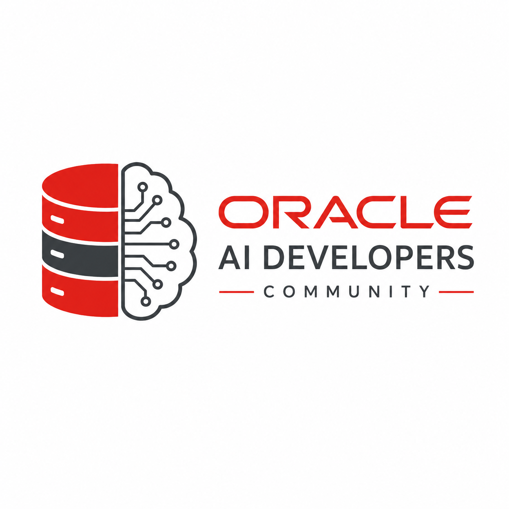

# Oracle-AI-Developers-Community

  

Welcome to the **Oracle AI Developers Community**! This repository is a **completely open-source** resource hub for developers building innovative applications, intelligent agents, and scalable systems using Oracle AI Database and Oracle Cloud Infrastructure (OCI) services. Our goal is to foster a vibrant, open community where knowledge is shared, projects are showcased, and contributions drive the advancement of AI-driven solutions.

## Our Mission

Our mission is to empower developers with the essential resources, in-depth knowledge, and cutting-edge tools required to construct intelligent applications leveraging the power of Oracle AI Database. We are dedicated to cultivating a dynamic environment for exchanging ideas, highlighting groundbreaking projects, and collectively advancing the frontier of AI-powered solutions.

## What You'll Find Here

This repository is structured to provide easy access to critical information:

*   **Features**: Explore the latest advancements in Oracle AI Database, including detailed insights into Oracle Database 23ai and the upcoming Oracle Database 26ai, with a focus on AI Vector Search and agentic AI capabilities.
*   **Community**: Discover how developers are innovating with Oracle AI, delve into compelling use cases, and learn from success stories within our growing community.
*   **Partners**: Acknowledge our valued partners and contributors, such as Datacules LLC, who are instrumental in propelling the community forward.
*   **Licensing**: Understand the licensing framework for using Oracle technologies and the attribution guidelines for contributions, including those from partners like Datacules LLC.
*   **Assets**: Access logos and other visual resources for community use.
*   **MCP**: Learn about Model Context Protocol (MCP) servers and how to integrate them with Oracle AI Database and older versions.
*   **Fusion Applications**: Explore the AI-centric innovations across Oracle Fusion Cloud ERP, HCM, SCM, and CX.
*   **Healthcare**: Discover how Oracle AI and database technologies are transforming healthcare through clinical AI agents and AI-native EHRs.

Join us in exploring the transformative power of AI with Oracle! This is a community-driven, open-source project, and we welcome everyone to contribute and help us grow.
