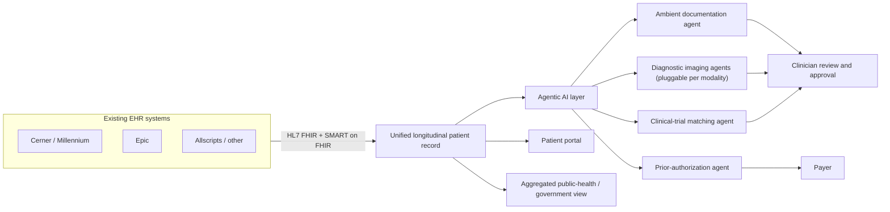
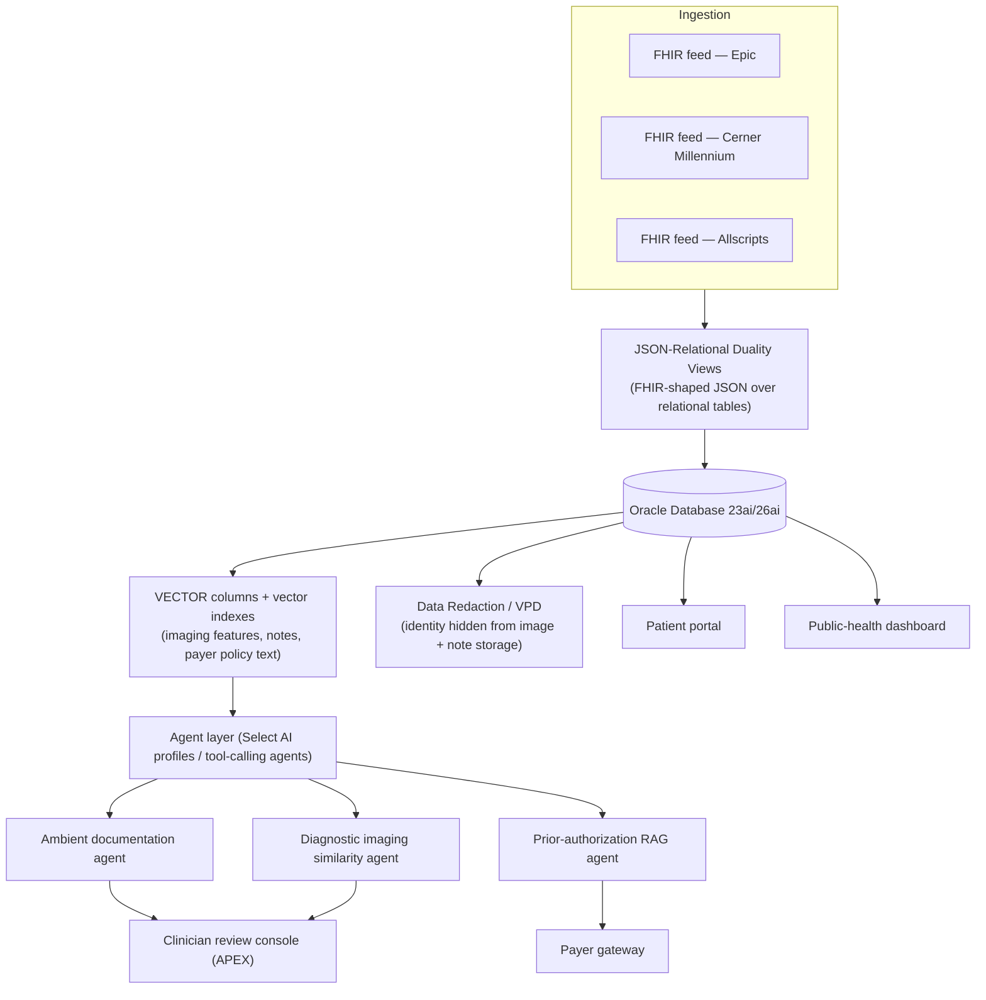

# Oracle Health Agentic AI & Interoperability Vision (Ellison–Mihaljevic Keynote, 2026)

## Purpose

This skill captures the product strategy and design philosophy Oracle Health is pursuing for AI-native, interoperable healthcare systems, as articulated in a fireside conversation between Larry Ellison (Oracle) and Dr. Tomislav Mihaljevic, MD (CEO, Cleveland Clinic) at the Oracle Health and Life Sciences Summit (September 2026, Orlando, FL).

It gives an AI coding agent or developer the *why* behind Oracle Health's architectural direction — agentic, forms-free clinical software; multi-EHR/multi-provider interoperability; an open marketplace for diagnostic AI models; and security-by-de-identification — so that integrations, extensions, or new modules built for this ecosystem align with the stated direction rather than fighting it.

## Scope

**Covered:** product vision, architectural principles, interoperability strategy, AI-agent use cases in clinical and operational healthcare workflows, and the reasoning behind specific design choices, as described in the session.

**Explicitly out of scope / not provided by the source:** this is a strategic fireside chat, not a technical workshop. The transcript contains **no SQL, PL/SQL, schema definitions, REST/GraphQL API specifications, vector-search implementation details, or benchmark numbers** beyond a single reimbursement-gap figure. Where the discussion references specific technologies (e.g., an Nvidia diagnostic imaging model, SMART on FHIR), those are named but not specified in implementation detail. Treat this document as architectural/strategic context to pair with Oracle's actual technical documentation — not as a standalone implementation guide.

## When to Use This Skill

- Orienting a new integration or module to Oracle Health's stated interoperability requirements (HL7 FHIR / SMART on FHIR) instead of a proprietary format.
- Designing an AI agent for clinical documentation, diagnostic imaging, prior authorization, or care coordination and wanting to match Oracle Health's described UX philosophy (agentic, forms-free, human-reviewed).
- Explaining to stakeholders *why* Oracle Health favors an open, plug-in ecosystem for diagnostic AI models rather than a single proprietary model.
- Reasoning about data governance/security defaults (de-identification) for healthcare data at rest.
- Understanding the operational (staffing, supply chain, payer) surface area that a "complete" healthcare platform is expected to cover, beyond the clinical record itself.

## Core Concepts

### 1. Ambient, agentic clinical documentation
The session describes AI agents that listen to (or otherwise observe) a clinician–patient consultation and automatically draft the resulting note, medication changes, and orders — including material discussed in multi-specialist settings like a tumor board — for the clinician to quickly review, edit, and approve, rather than requiring manual data entry. The stated goal is to remove clerical burden so clinicians spend their time on patients or research instead of the record itself.

### 2. Diagnostic AI as an open, pluggable ecosystem
Oracle Health ships a diagnostic imaging model (the speaker names one supplied by Nvidia for CT/MRI/biopsy interpretation) but the system is described as designed for other vendors — specialty hospitals, academic centers, or startups — to plug in their own specialized models for a given modality (e.g., a biopsy-slide specialist vs. a CT specialist), likened to a marketplace of modules. Interoperability with outside vendors (Siemens is named for diagnostic imaging) is achieved through the same standards-based approach used elsewhere in the platform.

### 3. Multi-EHR, multi-provider longitudinal patient record
A central design position: the health record belongs to the patient, not to the hospital or the EHR vendor that generated it. The patient portal Oracle Health built is described as multi-EHR (ingesting Cerner, Epic, Allscripts, and other formats) and multi-provider/multi-hospital, assembling a single longitudinal record regardless of source system.

### 4. Standards-based interoperability (HL7, FHIR, SMART on FHIR)
This multi-EHR capability, and the ability for outside vendors to plug components (e.g., a third party's radiology module) into an Oracle Health deployment, is attributed directly to building on HL7/FHIR and SMART on FHIR rather than a closed, Oracle-only format. The speaker frames this explicitly as a requirement for coexisting with Epic and Allscripts installations rather than displacing them outright.

### 5. Payer–provider automation (prior authorization)
AI models trained on payer policy rules (e.g., eligibility criteria and thresholds such as BMI cutoffs for a given medication) are described as reading those rules exhaustively so a provider learns in advance whether a prior-authorization request is likely to be approved — reducing the iterative back-and-forth between provider and payer that both sides currently find costly and slow.

### 6. Early detection research: circulating tumor DNA and metagenomic sequencing
Circulating tumor DNA testing is discussed as an early-cancer-detection approach, with a noted limitation (false positives from cancers the immune system already controls). Separately, the speaker describes research (via the Ellison Institute of Technology at Oxford) into a single metagenomic blood test that would sequence all DNA present in a blood sample — host DNA for oncology markers and non-host ("guest") DNA for infections — as a faster, more comprehensive alternative to culture-based pathology. The speaker states such a test, had it existed, could plausibly have flagged SARS-CoV-2 earlier.

## Key Principles

- **The patient, not the hospital or vendor, owns the longitudinal record.** Architecture should assemble a complete record across sources rather than fragmenting it by EHR format.
- **No manual form entry as the default interaction model.** Clinical software should capture structured data from the natural workflow (conversation, orders spoken aloud) rather than requiring clinicians to type into forms.
- **Standards over proprietary lock-in.** HL7/FHIR and SMART on FHIR are the stated basis for both ingesting outside EHR data and letting outside vendors plug components into the platform.
- **Coexistence, not full displacement.** The stated goal is interoperating with Epic, Allscripts, and other systems already installed at a given site, not requiring their replacement.
- **Openness enables an ecosystem no single vendor could build alone.** The speaker states explicitly that automating the entire healthcare ecosystem is "too big" for Oracle to do by itself, hence the plug-in model for diagnostic AI and imaging partners.
- **Human-in-the-loop remains a legal and practical requirement in clinical settings**, even as model error rates fall — AI drafts and assists; a clinician reviews and decides.
- **Security by de-identification at rest.** Diagnostic images and related data are described as stored without identifying information in the first place (not de-identified after the fact); identity is only resolvable by separately accessing the protected EHR itself.
- **Quality improvements are framed as the primary cost lever**, not rationing — e.g., proactive home monitoring and medication-adherence reminders to avoid readmissions, rather than restricting access to care.

## Architecture / Design Patterns

The following diagram is a conceptual synthesis of the interoperability and agentic-AI patterns described in the session — it is not a diagram presented in the source material itself.



The consultation-to-record workflow described for ambient documentation:

```mermaid
sequenceDiagram
    participant P as Patient
    participant Dr as Clinician
    participant AI as Ambient AI agent
    participant EHR as Health record
    P->>Dr: Consultation
    Dr->>P: Diagnosis, orders, medication changes (spoken)
    AI->>AI: Listens; drafts note, orders, medication changes
    AI->>Dr: Presents draft for quick review
    Dr->>AI: Edits and approves
    AI->>EHR: Commits final note and orders
```

**Diagnostic AI plug-in pattern:** a base model is provided (Nvidia, in the example given) but the platform is designed so a specialty vendor's model for a specific modality (biopsy slide, CT, MRI) can be substituted or added, on the premise that specialization per modality outperforms one general model.

**Security pattern:** store clinical images/data without embedded identity by default, so a data breach of the image store alone does not expose whose record it is; identity resolution requires separate, protected access to the EHR system.

## Illustrative Oracle 23ai/26ai Implementation Patterns

> The session names no concrete technology stack for its own systems. Everything in this section is **added by this skill, not part of the original conversation** — one concrete way an Oracle Database 23ai/26ai-based system could realize the architectural principles above, using Oracle's actual AI Vector Search, Select AI (`DBMS_CLOUD_AI`), JSON-Relational Duality Views, and Data Redaction features. Treat it as a reference pattern to adapt, not as Oracle Health's disclosed internal implementation.

### A. Layered reference architecture



### B. Multi-EHR ingestion via JSON-Relational Duality Views

Duality views let an ingestion adapter write/read one FHIR-shaped JSON document per patient regardless of the originating EHR's native format, while the data underneath stays in ordinary, constrained relational tables — one concrete way to realize "the record belongs to the patient, assembled across sources."

```sql
CREATE TABLE patients (
    patient_id  NUMBER GENERATED ALWAYS AS IDENTITY PRIMARY KEY,
    mrn         VARCHAR2(64) NOT NULL,
    source_ehr  VARCHAR2(20) NOT NULL,   -- 'CERNER' | 'EPIC' | 'ALLSCRIPTS'
    birth_date  DATE
);

CREATE TABLE encounters (
    encounter_id   NUMBER GENERATED ALWAYS AS IDENTITY PRIMARY KEY,
    patient_id     NUMBER NOT NULL REFERENCES patients(patient_id),
    encounter_type VARCHAR2(64),
    encounter_ts   TIMESTAMP
);

CREATE OR REPLACE JSON RELATIONAL DUALITY VIEW patient_record_dv AS
patients @insert @update
{
    _id: patient_id,
    mrn: mrn,
    sourceEhr: source_ehr,
    birthDate: birth_date,
    encounters: encounters @insert @update @delete
    {
        encounterId: encounter_id,
        type: encounter_type,
        timestamp: encounter_ts
    }
};
```

### C. Ambient documentation as a draft-then-approve state machine

Models the "agent drafts, clinician approves" principle as an explicit workflow state rather than letting an agent write directly to the record.

```sql
CREATE TABLE clinical_note_drafts (
    draft_id      NUMBER GENERATED ALWAYS AS IDENTITY PRIMARY KEY,
    encounter_id  NUMBER NOT NULL REFERENCES encounters(encounter_id),
    draft_text    CLOB,
    draft_orders  JSON,
    status        VARCHAR2(20) DEFAULT 'PENDING_REVIEW'
                   CHECK (status IN ('PENDING_REVIEW','APPROVED','EDITED','REJECTED')),
    created_ts    TIMESTAMP DEFAULT SYSTIMESTAMP,
    reviewed_by   VARCHAR2(64),
    reviewed_ts   TIMESTAMP
);

CREATE OR REPLACE PACKAGE ambient_doc_agent AS
    -- Called by the ambient-listening agent after a consultation
    PROCEDURE submit_draft(
        p_encounter_id IN NUMBER,
        p_draft_text   IN CLOB,
        p_draft_orders IN JSON
    );

    -- Called only from the clinician review UI (e.g. an APEX page)
    PROCEDURE approve_draft(
        p_draft_id   IN NUMBER,
        p_reviewer   IN VARCHAR2,
        p_final_text IN CLOB DEFAULT NULL  -- NULL = approve as drafted
    );
END ambient_doc_agent;
/
```
(Package body omitted — the point is the state machine: an agent only ever inserts a `PENDING_REVIEW` row; only `approve_draft`, called by an authenticated clinician session, can move a draft into the record proper.)

### D. Diagnostic imaging similarity search (pluggable per modality)

Maps the "base model + swappable specialty models" plug-in pattern onto AI Vector Search: each modality gets its own vector column/index, and a specialty vendor's model only needs to write into the same shape to participate.

```sql
CREATE TABLE imaging_studies (
    study_id     NUMBER GENERATED ALWAYS AS IDENTITY PRIMARY KEY,
    encounter_id NUMBER NOT NULL REFERENCES encounters(encounter_id),
    modality     VARCHAR2(20),           -- 'CT' | 'MRI' | 'BIOPSY_SLIDE'
    model_source VARCHAR2(64),           -- e.g. 'NVIDIA_BASE', 'PARTNER_BIOPSY_V2'
    feature_vec  VECTOR(1024, FLOAT32),  -- dimension/model swappable per vendor
    findings     JSON
);

CREATE VECTOR INDEX imaging_feature_idx
    ON imaging_studies (feature_vec)
    ORGANIZATION NEIGHBOR PARTITIONS
    DISTANCE COSINE;

-- Surface comparable prior cases for a new scan in the review console
SELECT study_id, modality, findings
FROM   imaging_studies
WHERE  modality = :new_modality
ORDER BY VECTOR_DISTANCE(feature_vec, :new_feature_vec, COSINE)
FETCH FIRST 5 ROWS ONLY;
```

### E. Prior-authorization pre-screening with Select AI (RAG over payer policy)

Maps "the AI reads every payer rule in exhaustive detail" onto Select AI's retrieval-augmented generation: a vector index built over payer policy documents, queried in natural language before a request is filed.

```sql
BEGIN
  DBMS_CLOUD_AI.CREATE_VECTOR_INDEX(
    index_name => 'PAYER_POLICY_INDEX',
    attributes => '{"vector_db_provider": "oracle",
                     "vector_table_name": "payer_policy_vectors",
                     "vector_distance_metric": "cosine"}'
  );

  DBMS_CLOUD_AI.CREATE_PROFILE(
    profile_name => 'PRIOR_AUTH_PROFILE',
    attributes   => '{"provider": "oci",
                       "credential_name": "GENAI_CRED",
                       "vector_index_name": "PAYER_POLICY_INDEX",
                       "temperature": 0.0}'
  );
END;
/

EXEC DBMS_CLOUD_AI.SET_PROFILE('PRIOR_AUTH_PROFILE');

SELECT AI narrate
'Given a patient with BMI 27, is GLP-1 therapy X eligible for prior
 authorization under the current payer policy, and if not, which
 threshold is missing?';
```

### F. De-identification by design (Data Redaction)

Expresses "store without identity in the first place" as an enforced Oracle security policy rather than an application-layer convention.

```sql
BEGIN
  DBMS_REDACT.ADD_POLICY(
    object_schema  => 'HEALTH',
    object_name    => 'PATIENTS',
    column_name    => 'MRN',
    policy_name    => 'HIDE_PATIENT_MRN',
    function_type  => DBMS_REDACT.FULL,
    expression     => q'[SYS_CONTEXT('EHR_APP','ROLE') != 'EHR_IDENTITY_RESOLVER']'
  );
END;
/
```
Any session without the `EHR_IDENTITY_RESOLVER` role sees a redacted MRN; only the protected identity-resolution path can see the real value — the same "identity only resolvable through the protected EHR" pattern described in the session, made concrete and enforced at the SQL layer.

## Operational Scope Beyond the Clinical Record

The session frames a "complete" health system platform as also covering:

| Domain | What the session describes |
|---|---|
| Staffing / HCM | Tracking clinician licensure and credentials (which vary by state and by country) so scheduling automatically respects who is legally qualified to perform a given procedure; also handles pay for staff who work across multiple affiliated hospitals or maintain a private practice. |
| Supply chain / inventory | Real-time inventory visibility and reordering, plus locating a specific item (the example given is finding the nearest vial of tranexamic acid) within a hospital, since hospital inventory is described as physically decentralized. |
| Payer relations | Automated prior-authorization pre-screening against payer policy rules (see Core Concepts, #5). |
| Public health / government | Aggregating multi-provider, multi-EHR data to give regulators and health officials a real-time national or regional view — bed availability, vaccination rates, equipment inventory — cited against the difficulty of getting that picture during COVID-19. |

## Security & AI-Safety Posture

- **Cybersecurity is framed as an AI-vs-AI arms race.** The speaker's position is that defending against AI-assisted attacks with pre-AI defensive tooling is inadequate, and cites large ongoing investment in Oracle Cloud Infrastructure (OCI) data centers partly for this reason. The conversation was recorded shortly after the release of Anthropic's Mythos-tier model, which the speaker frames as simultaneously raising both offensive and defensive AI capability.
- **On hallucinations:** the speaker states that leading models (naming OpenAI and Anthropic specifically) have sharply reduced hallucination rates, drawing an analogy to self-driving cars — not error-free, but erring less often than the human baseline they're compared against. This is offered as reassurance, not as grounds for removing clinician review, which the speaker describes as still legally required in healthcare.
- **De-identification by default** (see Architecture section) is presented as the core data-protection pattern for images and similar data.

## Practical Workflow for Builders

Based on the strategic guidance in this session, when building an integration or agent for this ecosystem:

1. **Integrate via HL7 FHIR / SMART on FHIR** rather than a proprietary interface, both for pulling multi-EHR data and for exposing a component others can plug into.
2. **Default to an agent-drafts, human-approves pattern** for anything that writes to the clinical record — don't design a workflow that requires manual form entry when the underlying data (a conversation, a spoken order) already exists in a captured form.
3. **Design diagnostic/clinical AI components to be swappable per specialty/modality** rather than assuming one general model suffices — the platform's stated model is a marketplace of specialized plug-ins.
4. **Store sensitive artifacts (imaging, etc.) without embedded identity** wherever feasible, resolving identity only through the protected EHR path.
5. **Account for jurisdiction-specific rules** (state-to-state and country-to-country) in any credentialing, staffing, or compliance logic — the session is explicit that these rules are not uniform.
6. **Do not assume single-vendor completeness.** The stated philosophy is an open ecosystem specifically because one company solving the entire problem alone is described as impractical.

## Anti-Patterns / What to Avoid

- Building a closed, hospital- or vendor-locked record format — the session explicitly frames the record as belonging to the patient, not the institution.
- Requiring manual form-filling as the primary clinical data-entry mechanism.
- Treating a single diagnostic AI model as sufficient for all imaging modalities rather than allowing specialization.
- Removing human clinician review on the assumption that AI error rates are now negligible — the session frames human-in-the-loop as a continuing legal requirement in healthcare, not just a current-generation limitation.
- Approaching cost reduction primarily through rationing/access restriction rather than through quality improvement and administrative automation — the session frames these as counterproductive to patient acceptance and to the stated goal of affordable, high-quality care.
- Assuming one vendor can or should build the entire healthcare AI ecosystem alone.

## Terminology

| Term | Meaning as used in the session |
|---|---|
| Ambient documentation | AI-generated draft notes/orders produced automatically from a clinician–patient interaction |
| Agentic AI | AI systems described as acting as assistants/agents carrying out multi-step tasks (drafting orders, matching patients to trials) rather than simple single-turn tools |
| SMART on FHIR | The standards combination the session credits for enabling multi-EHR ingestion and third-party component plug-in |
| Prior authorization | The payer approval process for a treatment/medication, described as a target for AI-driven pre-screening |
| Circulating tumor DNA (ctDNA) | Tumor-derived DNA detectable in blood, discussed as an early cancer-detection signal with a false-positive risk |
| Metagenomic blood test | A proposed single blood test sequencing all DNA present (host and non-host) to detect both oncological and infectious findings in one pass |
| De-identification (by design) | Storing data without identity attached from the outset, rather than stripping identity from already-identified data after the fact |

## Limitations of This Source

This document reflects a single fireside conversation, not Oracle Health product documentation. Company names, product capabilities, and figures mentioned reflect the speakers' statements as given; several (e.g., the exact scope of the Nvidia diagnostic model, the specific reimbursement-gap figure Dr. Mihaljevic cites) are not independently elaborated in the transcript and should be verified against Oracle Health's official technical and product documentation before being treated as specifications. No code, schema, or API detail was present in the source itself — the "Illustrative Oracle 23ai/26ai Implementation Patterns" section above is a separate, clearly-marked addition by this skill, not a reconstruction of anything Oracle Health has disclosed about its actual implementation.

---
*Source: fireside conversation between Larry Ellison (Oracle) and Dr. Tomislav Mihaljevic, MD (CEO, Cleveland Clinic), Oracle Health and Life Sciences Summit, September 2026, Orlando, FL.*
*Compiled for the [Oracle AI Developers Community](https://github.com/hvrcharon1/Oracle-AI-Developers-Community).*
